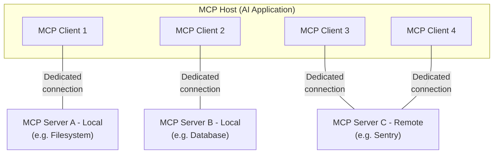

# What is the Model Context Protocol (MCP)?

MCP (Model Context Protocol) is an open-source standard for connecting AI applications to external systems.

Using MCP, AI applications like Claude or ChatGPT can connect to data sources (e.g. local files, databases), tools (e.g. search engines, calculators) and workflows (e.g. specialized prompts)—enabling them to access key information and perform tasks.

Think of MCP like a USB-C port for AI applications. Just as USB-C provides a standardized way to connect electronic devices, MCP provides a standardized way to connect AI applications to external systems.

<Frame>
  
</Frame>

## What can MCP enable?

* Agents can access your Google Calendar and Notion, acting as a more personalized AI assistant.
* Claude Code can generate an entire web app using a Figma design.
* Enterprise chatbots can connect to multiple databases across an organization, empowering users to analyze data using chat.
* AI models can create 3D designs on Blender and print them out using a 3D printer.

## High level Components:
> MCP is stateful protocol // The purpose of lifecycle management is to negotiate the capabilities that both client and server support.
- MCP Host: The AI application that coordinates and manages one or multiple MCP clients
- MCP Client: A component that maintains a connection to an MCP server and obtains context from an MCP server for the MCP host to use
- MCP Server: A program that provides context to MCP clients
> 1 MCP Client <==> 1 MCP Server

- Conceptually the `data layer` is the inner layer, while the `transport layer` is the outer layer. [MCP Docs on layers](https://modelcontextprotocol.io/docs/learn/architecture#layers)
